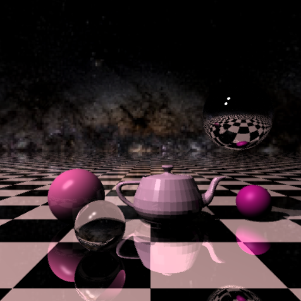

## Задание 1: Трассировка лучей Whitted-а

### Сборка: 

mkdir build

cd build

cmake -DCMAKE\\_BUILD\\_TYPE=Release ..

make -j 4

### Запуск: 

./rt −out <output_path> −scene <scene_number> −threads \<threads>

[Используемые открытые источники](https://github.com/ssloy/tinyraytracer)

### Базовая часть: 15 баллов

* Освещение по модели фонга;

* Тени;

* Зеркальные отражения;

* Материалы: 

	* стекло,

	* зеркало,

	* слоновая кость,

	* резина;

* Примитивы:

	* сфера,

	* бесконечная плоскость;

* Два источника света;

* Рендеринг одного изображения занимает не больше 1 секунды;

* Разрешение выходного изображения – 512x512.

### Дополнительная часть: 8 баллов

* 3D-модель чайника из Юты (+4);

* Устранение ступенчатости (+1);

* Карты окружения в виде кубической панорамы (+1);

* Использование многопоточности (+2).

